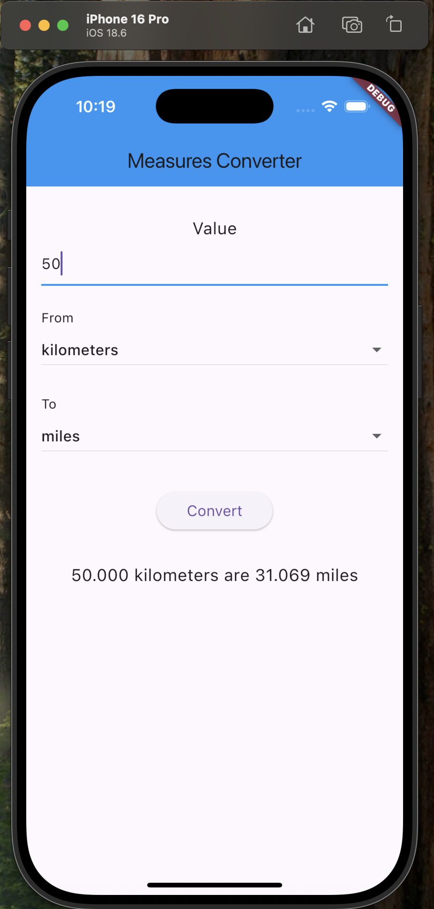
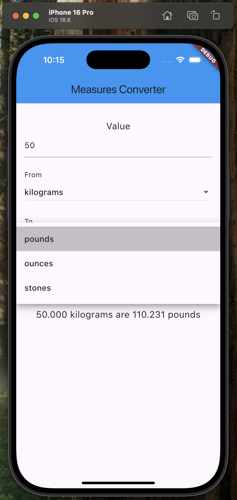

# Measures Converter

A modern, production-ready Flutter app for converting between metric and imperial units of distance and weight. Designed for clarity, reliability, and extensibility, this app is ideal for both educational and professional use. The intuitive interface and robust logic ensure accurate conversions and a seamless user experience on mobile platforms.

## Features & Constraints

- **Bidirectional Conversion:** Only allows conversions between metric and imperial systems (e.g., meters to feet, pounds to kilograms). Conversions within the same system are strictly disallowed.
- **Type Safety:** Only units of the same type (distance or weight) can be converted. For example, you cannot convert meters to pounds or grams to miles.
- **Intuitive UI:** The app features a clean, modern interface with a blue header and highlighted input field, making it easy to enter values and select units. The design is optimized for clarity and accessibility, ensuring a seamless user experience on mobile devices.
- **Error Handling:** Input validation ensures only non-negative, valid numbers are accepted. Clear error messages are shown for invalid input.
- **Dynamic Dropdowns:** The 'To' dropdown automatically updates to show only valid target units based on the selected 'From' unit and type.
- **Extensible Architecture:** Code is modular, with clear separation of models, services, and screens for maintainability and scalability.
- **Test Coverage:** Includes both unit and widget tests for conversion logic and UI reliability.
- **Platform Ready:** Includes setup instructions for iOS simulator and is compatible with iOS development workflows.

## Folder Structure

```
lib/
  main.dart                      # App entry point
  models/
    unit.dart                    # Unit model class
  services/
    conversion_service.dart       # Conversion logic
  screens/
    measures_converter_screen.dart # Main UI screen

test/
  conversion_service_test.dart    # Unit tests for conversion logic
  widget_test.dart                # Widget/UI tests

build/                            # Build artifacts
ios/                              # iOS platform files
analysis_options.yaml             # Dart analysis options
measures_converter.iml            # IntelliJ project file
pubspec.yaml                      # Project manifest
pubspec.lock                      # Package lock file
```

## How to Run the App

1. Ensure you have Flutter installed (see https://docs.flutter.dev/get-started/install).
2. In the project root, run:
   ```zsh
   flutter pub get
   flutter run
   ```

## How to Run Tests

1. In the project root, run:
   ```zsh
   flutter test
   ```
   This will run all tests in the `test/` directory, including unit and widget tests.

## iOS Setup Instructions (Flutter on macOS)

Follow these steps to configure and run this Flutter project on an iPhone simulator:

### 1. Install Homebrew (if not already installed)
```bash
/bin/bash -c "$(curl -fsSL https://raw.githubusercontent.com/Homebrew/install/HEAD/install.sh)"
```

### 2. Install Required Tools
- **Xcode** (latest from the App Store).
- **CocoaPods** (for iOS dependencies):
  ```bash
  sudo gem install cocoapods
  ```
  Verify with:
  ```bash
  pod --version
  ```

### 3. Configure Xcode
```bash
sudo xcode-select -s /Applications/Xcode.app/Contents/Developer
sudo xcodebuild -runFirstLaunch
sudo xcodebuild -license accept
```
Open **Xcode → Settings → Platforms** and install at least one iOS simulator runtime (e.g., iOS 18.x). Alternatively, use the following command to install an iOS simulator -
```bash
xcodebuild -downloadPlatform iOS
```

### 4. Enable iOS Support in Flutter Project
From the project root:
```bash
flutter create --platforms=ios .
```

### 5. Install iOS Dependencies
```bash
cd ios
pod install
cd ..
```

### 6. Run on iPhone Simulator
Start the simulator:
```bash
open -a Simulator
```
List available devices:
```bash
flutter devices
```
Run the app on a simulator:
```bash
flutter run -d "iPhone 16 Pro"
```

## Demo

<video src="demo/demo.mp4" controls width="600">
  Your browser does not support the video tag.
</video>

## Screenshots


*From unit selection dropdown*


*Imperial to metric conversion*


*Metric to imperial conversion*


*Validation for negative number input*


*Validation for non-numeric input*


*Unit type matching enforcement*

## Notes
- The app supports conversion between a wide range of metric and imperial units for both distance and weight.
- Code is organized for clarity and maintainability, following Dart best practices and conventions.
- Inline comments and error handling are included for usability and readability.
- Widget and logic tests are provided for reliability.